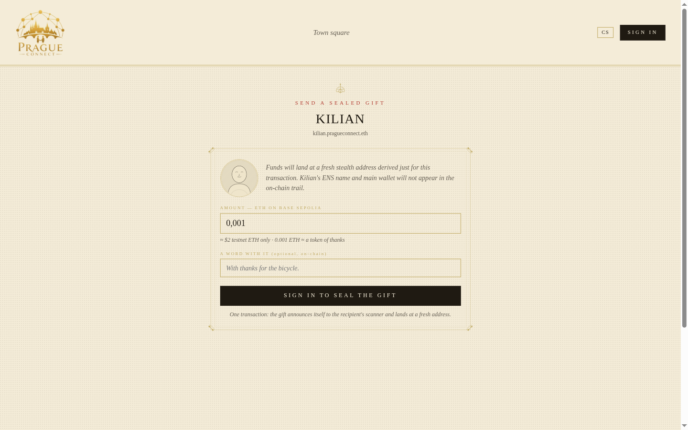
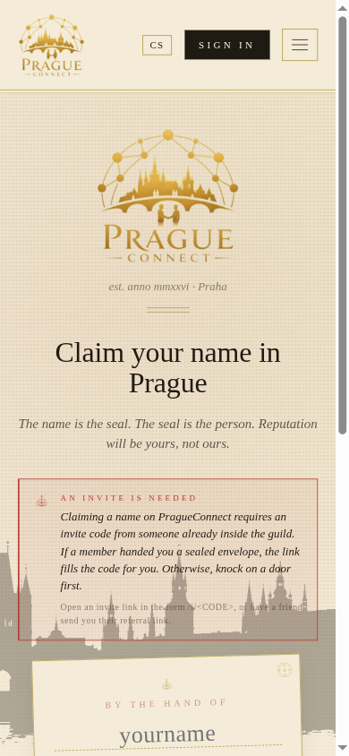

# PragueConnect

**A peer-to-peer marketplace for human favors, where the receipts belong to the person who earned them.**

Live at **[pragueconnect.xyz](https://www.pragueconnect.xyz/)** · ENS-native at `<name>.pragueconnect.eth` · Payment rails on Base · Profiles served from decentralized storage (Swarm primary, IPFS fallback).

> *"Like Craigslist, if Craigslist were a guild ledger from Rudolfine Prague — every name a sealed inscription, every gift a wax stamp, every receipt a chiseled patent."*


---

## What it is

Each user claims a single ENS subname — `<name>.pragueconnect.eth` — and that one inscription is:

- their **account** (sign-in, identity, the only username that matters),
- their **public personal site** (rendered HTML pinned to decentralized storage; the CID lives in the subname's `contenthash`),
- their **sealed letterbox** (XMTP V3 / MLS — end-to-end encrypted DMs),
- their **on-chain receipt trail** (every tip received, every escrow released, attested to a key they control),
- their **stealth gift route** (ERC-5564 meta-address — payments derive a fresh, unlinkable address each time).

Everything that's a "platform feature" elsewhere is an **ENS text record** here. There is no platform database. The marketplace data (offers, bios, skills, locations) lives as text records on each user's subname; the payment rails (tips, four-phase escrow) live on Base; messaging is XMTP. PragueConnect is the orchestrator — and the parts that are most portable away from us (XMTP inbox, ENS subname records, on-chain receipts) work even if we vanish. The parts that depend on our gateway today (stealth-address bulletin, KV-stored text records before they're pinned to storage) have explicit "anchor on-chain" / "publish to storage" exits — see *Privacy posture* below for the honest picture of what's portable when.

---

## How it works

**Identity.** A two-signature onboarding inscribes `<name>.pragueconnect.eth` and derives an ERC-5564 stealth meta-address from a deterministic message. New users have privacy by default — not as a setup step, not as a checkbox.

**Discovery.** `/feed` lists every subname, flattens each user's `offers` text record, and ranks by recency. Filters are sigil chips (handyman / language exchange / errand / ride / gift). No algorithm in the middle.

**Tipping.** `/tip/<ens>` reads the recipient's `stealth-meta-address`, derives a fresh stealth address client-side, calls `PragueConnectTip.tip(...)` on Base. The contract atomically transfers ETH and announces via the canonical ScopeLift ERC-5564 announcer. **Block-explorer view ≠ profile view; the link is broken at the speed of one transaction.**



**Referrals.** A user invited by another carries a `sealed-by` text record. When they tip a third party, the contract atomically routes 95% to the recipient's stealth address and 5% to the inviter's stealth address — two announces, one transaction, no dust. `tipWithReferral` makes finder's-marks programmable.

**Escrow.** `/m/<peer>` is an XMTP-encrypted thread keyed by ENS. Above the message stream sits a four-phase escrow widget — **Nigredo** (funded) → **Albedo** (worker accepted) → **Citrinitas** (delivered) → **Rubedo** (released). The worker's main wallet **never appears in any escrow transaction** — they sign EIP-712 intents off-chain with their stealth spending key, and a relayer (or anyone) submits the transaction on their behalf. After 7 days in Albedo without delivery, the funder can reclaim funds; after 24h in Citrinitas without release, the worker can self-release.

**Receipts.** Every profile shows real on-chain receipts — `Tipped`, `TaskReleased`, `Referral` events filtered by the user's address. Receipts at rotated stealth addresses get aggregated into the wallet view via a per-user bulletin (auth-gated) and an optional on-chain anchor on the canonical announcer, so the wallet stays scannable even if PragueConnect's gateway disappears.

---

## Privacy posture

PragueConnect ships **per-payment unlinkability** out of the box:

- **ERC-5564 stealth addresses, end-to-end.** Senders derive a one-time address per gift; the recipient's published address never receives funds directly. This always happens — there's no toggle.
- **Auto-rotating `addr()` resolution** *(opt-in via `/me/edit`; default-on for new claims).* When enabled, each ENS lookup of a user's subname mints a fresh stealth address from their meta, recorded in a per-user bulletin only the owner can read. Anyone resolving the name through any wallet/dApp gets a different stealth address than the previous resolver — no static address ever sits at the front door. Older claims that pre-date this default flip can switch it on in their settings.
- **EIP-712 sig-auth escrow.** The worker's main EOA never shows up as `msg.sender` of any escrow tx — they sign typed-data intents off-chain with their stealth spending key, and any address (relayer, funder, themselves from a fresh wallet) can submit. The on-chain `taskId` commits to the worker's spending-key-derived address, not their main EOA, so an analyst can't confirm a guessed pair by re-hashing.
- **Canonical ERC-5564 metadata layout** (`viewTag || 0xeeeeeeee || amount`), so any standard scanner (FluidKey, ScopeLift) can rebuild a recipient's history without trusting our gateway.
- **Memos are hash-committed, not plaintext on-chain.** The Tipped event emits `bytes32 memoHash`; an analyst pairing your EOA with `"for the cookies, alice"` won't. *Caveat:* the plaintext is sender-only today — there's no off-chain channel that delivers it to the recipient yet. Senders type memos, they get keccak'd and forgotten. We'll wire memos through XMTP next; until then, treat the memo field as personal note-taking, not a message to the recipient.
- **Optional bulletin anchoring.** Push your stealth-address mints to the canonical ERC-5564 announcer on-chain (one click in `/wallet`). Once anchored, your sweep history survives our gateway disappearing — any standard scanner reconstructs the list from on-chain logs. Today this is opt-in; we want it to be auto-anchor on mint.

What's **not yet shipped** is **anonymous aggregation** of those stealth pots into a single spendable balance. The naive sweep is a known weakness — academic work on Umbra ([arXiv 2308.01703](https://arxiv.org/pdf/2308.01703)) shows a Collector heuristic can deanonymize 25–66% of stealth payments at sweep time.

The intended architecture is a **per-recipient aggregator vault** that holds incoming tips at stealth addresses, triggers a `shield()` into a shielded pool only once cumulative balance crosses a credible-anonymity-set threshold, holds for a randomized 48–72h delay, and unshields in rounded denominations. Backend candidates we've evaluated (Railgun, 0xbow Privacy Pools, Cashu-on-EVM, Aztec) — see `AUDIT.md` for the full breakdown.

The honest line: *for sub-$50 tips, a single deposit-and-withdraw on any current shielded pool is fingerprintable. Aggregation requires batching by amount and time. We've designed the vault contract; PRs welcome.*

---

## Screens

A few of the rooms.

| | |
|---|---|
|  |  |
| **Public profile.** Bio, skills as alchemical sigils, send-a-private-gift / send-a-sealed-letter CTAs. The hand-drawn portrait roundel and wax seal on the avatar are deterministic per-name. | **Mobile.** The whole flow is mobile-first — claim, browse, tip, message. Czech / English toggle persists. |

The town square (`/feed`) is **invite-gated** — visitors who haven't claimed a name see a "behind the gate" panel asking them to enter with their seal first. Once claimed, the feed shows offers across every subname, ranked by recency, filterable by sigil family.

---

## Architecture

```
ENS lookup (any wallet/dApp)
        │
        ▼
  pragueconnect.eth resolver (mainnet)
        │  CCIP-Read (EIP-3668)
        ▼
  /api/ccip/{sender}/{data} (Vercel)
        │  signed responses verified on-chain
        ▼
  resolver-store: baseline JSON ∪ Vercel KV
        │
        ▼
  fresh stealth address (per-resolution rotation)
  + bulletin entry for the recipient
```

| Layer | Tech |
|---|---|
| Identity | ENS subnames under `pragueconnect.eth` (mainnet, our own resolver) |
| Resolution | CCIP-Read offchain resolver, gateway in this repo, signed responses |
| Wallet | Privy v3 (email / SMS / Google → embedded EOA, exportable) |
| Payments | Base mainnet (chain 8453) |
| Stealth crypto | `@fluidkey/stealth-account-kit` + `@scopelift/stealth-address-sdk` |
| Stealth rails | Canonical ERC-5564 announcer + ERC-6538 registry |
| Messaging | XMTP V3 / MLS |
| Profile hosting | Decentralized storage — Swarm (primary, via a Bee node) with IPFS fallback (Pinata). The CID is the `contenthash` of the ENS subname. |
| Frontend | Next.js 16 App Router (Turbopack), TypeScript, vanilla CSS |
| Hosting | Vercel (auto-deploy on push to `main`, root `web/`) |

---

## Run it locally

```bash
cd web
cp .env.example .env.local         # see comments inline for what each var is
bun install
bun run dev                        # → http://localhost:3000
```

Without env keys the design canvas renders without web3 wiring (useful for visual review). With keys, the full flow works against your configured chain.

```bash
cd contracts
forge test                         # 62/62 passing across 5 contracts
```

---

## Deployed addresses

### Mainnet (1) — ENS

| Contract | Address |
|---|---|
| `PragueConnectResolver` (CCIP-Read) | [`0x2F79b1950CcaA58259ea62bFe99107De75018D92`](https://etherscan.io/address/0x2F79b1950CcaA58259ea62bFe99107De75018D92) |
| `pragueconnect.eth` (NameWrapper-wrapped) | resolver → ↑ |

### Base mainnet (8453) — payment rails

| Contract | Address |
|---|---|
| `PragueConnectTip` | [`0x2069b483500aC9b9e6cA62893c39Bb144b615B49`](https://basescan.org/address/0x2069b483500aC9b9e6cA62893c39Bb144b615B49) |
| `PragueConnectEscrowV2` (sig-auth, 4-phase) | [`0xB38740a27c5803E2F5a3a3385232f0d2D5d0DCE5`](https://basescan.org/address/0xB38740a27c5803E2F5a3a3385232f0d2D5d0DCE5) |
| `PragueConnectInvites` | [`0x2a06246eeaf9b772cd3e7b8823298c0c8e89df48`](https://basescan.org/address/0x2a06246eeaf9b772cd3e7b8823298c0c8e89df48) |
| ScopeLift announcer (canonical) | `0x55649E01B5Df198D18D95b5cc5051630cfD45564` |
| ScopeLift registry (canonical) | `0x6538E6bf4B0eBd30A8Ea093027Ac2422ce5d6538` |

### Base Sepolia (84532) — testnet mirror

The same contracts are deployed on Base Sepolia and the live site at [pragueconnect.xyz](https://www.pragueconnect.xyz/) currently routes payments through the testnet pair so users can experiment without spending real ETH. Flipping production to mainnet is one env-var change (`NEXT_PUBLIC_DEFAULT_CHAIN_ID=8453`) plus updating the i18n strings that reference the chain by name.

ERC-7730 V2 clear-signing descriptors for both PragueConnect contracts in `contracts/erc-7730/`.

---

## Repo layout

```
ethprague/
├── README.md                       This file
├── FORKING.md                      How to stand up your own city  ← read this if forking
├── PLAN.md · PRDs.md · PRDs_V2.md  Design intent + per-loop specs
├── AUDIT.md                        Privacy audit + open work
├── web/                            Next.js 16, production target
│   ├── app/                        Routes — see table below
│   ├── data/subnames.json          Baseline subnames bundled into the resolver
│   └── lib/
│       ├── resolver.ts                    Resolver-store client
│       ├── resolver-store.ts              Baseline JSON ∪ Vercel KV ∪ memory overlay
│       ├── stealth.ts                     FluidKey + ScopeLift wrapper
│       ├── stealth-bulletin.ts            Per-user mint log (auth-gated)
│       ├── escrow.ts                      v2 sig-auth ABI + taskId derivation
│       ├── tip-events.ts                  Server-side getLogs for Tipped events
│       ├── xmtp.ts                        XMTP V3 client (cached)
│       ├── ipfs.ts · site-html.ts         Pin-to-Pinata + ENSIP-7 contenthash
│       └── (… ornaments, i18n, panels, forms)
└── contracts/                      Foundry
    ├── src/
    │   ├── PragueConnectResolver.sol      CCIP-Read offchain resolver
    │   ├── PragueConnectEscrowV2.sol      Sig-auth four-phase escrow
    │   ├── PragueConnectTip.sol           Tip + tipWithReferral (95/5 atomic)
    │   └── PragueConnectInvites.sol       Funded invites with reclaim
    ├── test/                       62/62 passing
    └── script/                     Deploy*.s.sol per contract
```

---

## Routes

| Route | What it is |
|---|---|
| `/` | Onboarding — claim a name, derive a stealth meta in two signatures |
| `/feed` | The town square — flattened offers across all subnames |
| `/[ensName]` | Public profile (mirrors what a wallet sees on-chain) |
| `/compose` | Post an offer / request |
| `/me/edit` | Edit text records, toggle stealth rotation, publish to IPFS |
| `/m/[label]` | XMTP-encrypted thread + four-phase escrow widget |
| `/tip/[ens]` | One-shot sealed gift via stealth address |
| `/r/[txHash]` | Receipt — Patent of Completion |
| `/wallet` | Ledger — direct + stealth balances aggregated, sweep-to-vault |
| `/api/ccip/[sender]/[data]` | CCIP-Read gateway (signs responses) |
| `/api/stealth/{bulletin,anchor,mark-swept,peek}` | Stealth address bookkeeping (auth-gated) |
| `/api/escrow-relay` | Relays sig-authed escrow intents (worker EOA never appears) |
| `/api/{claim-name,update-profile,publish-site,my-name,faucet-drip}` | Identity + profile + faucet |

---

## Fork it for your city

PragueConnect is the Prague instance of a city-shaped pattern. The stack is parameterized by one ENS parent name, one CCIP-Read gateway, two payment contracts, and a parchment reskin — everything else (privacy posture, stealth payments, escrow phases, marketplace logic) comes for free.

**See [FORKING.md](./FORKING.md)** for a step-by-step guide to standing up `BarcelonaConnect`, `LisbonConnect`, `BogotáConnect`, or whatever city is yours. About an afternoon of work; ~0.005 ETH on Base mainnet to deploy the rails plus ~0.003 ETH to register the parent ENS name.

> Reputation belongs to the human, not the city. A user can hold `kilian.pragueconnect.eth` and `kilian.barcelonaconnect.eth` and the same key signs both — they're the same person, surfaced in two town squares. This is on purpose.

---

## Operating notes

- **CCIP-Read resolver and gateway are entirely in this repo.** No third-party hosted resolver in the resolution path. The gateway signs responses with `PC_RESOLVER_SIGNER_KEY`; the resolver verifies on-chain. Verified end-to-end: external wallets resolve `<name>.pragueconnect.eth` via mainnet ENS Registry → our resolver → our gateway → signed response.
- **The store reads from baseline JSON ∪ Vercel KV ∪ in-memory overlay.** KV is auto-detected via `KV_REST_API_URL` + `KV_REST_API_TOKEN`. One-click provisioning in Vercel dashboard → Storage → Create KV.
- **Stealth bulletin** is per-user, auth-gated. Only the name's owner can read its mint history; anyone else just sees the latest stealth address (which becomes public the moment funds land at it).
- **Faucet drip** (`POST /api/faucet-drip`) sends ~0.005 ETH to any Privy-authenticated user whose balance is below 0.001 ETH. Rate-limited to one drip per address per 24h. Requires `PC_FAUCET_KEY` env. Auto-disabled if env is missing.
- **Decentralized profile storage.** `web/app/api/publish-site/route.ts` renders a self-contained HTML page (inline CSS, inline SVGs — no external assets) and uploads it to **Swarm** (canonical) via a configured Bee node, falling back to **IPFS via Pinata** if Swarm is unconfigured or unreachable. The returned reference is encoded as an ENSIP-7 `contenthash` and written to the subname, so any wallet/dApp resolving the name discovers the profile without going through our app. Profiles render a "served from Swarm" / "served from IPFS" badge linking to a public gateway so anyone can verify the same content without trusting us.
- **About `<name>.pragueconnect.eth.limo`**: eth.limo's wildcard cert only covers `*.eth.limo`, not three-level subdomains. So `<name>.pragueconnect.eth.limo` URLs **don't render in browsers** — that's an eth.limo platform constraint, not something we can fix from the resolver. Mainnet ENS resolution itself works fine; the Swarm/IPFS gateway URL on each profile is the censorship-resistant view, and the canonical Vercel-hosted profile at `pragueconnect.xyz/<ens>` is the interactive view.

---

## License

MIT — see `LICENSE`. The PragueConnect *brand* (parchment palette, Rudolfine voice, fleur-de-lis stamps, the `pragueconnect.eth` parent) belongs to the original project. The **stack** — protocol primitives, contract patterns, gateway code — is yours to fork freely.
